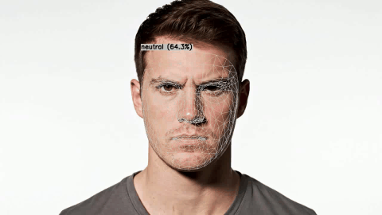

# Emotion Detection using Deep Learning

A real-time emotion detection system that uses a Convolutional Neural Network (CNN) built with PyTorch to classify facial expressions into 7 different emotions. The system can detect emotions from static images and perform real-time emotion detection using a webcam with face mesh visualization.

## 🎥 Demo



## 🎭 Detected Emotions

The model can classify the following 7 emotions:
- 😠 **Angry**
- 🤢 **Disgusted**
- 😨 **Fearful**
- 😊 **Happy**
- 😐 **Neutral**
- 😢 **Sad**
- 😲 **Surprised**

## ✨ Features

- **Deep Learning Model**: CNN architecture built with PyTorch
- **Real-time Detection**: Live emotion detection using webcam
- **Face Mesh Visualization**: Beautiful white/light grey face mesh overlay using MediaPipe
- **High Accuracy**: Trained on a large dataset with train/test split
- **GPU Support**: Automatically utilizes GPU if available
- **User-friendly**: Simple command-line interface

## 📁 Project Structure

```
Emotion Detection/
│
├── data/
│   ├── train/          # Training images organized by emotion
│   │   ├── angry/
│   │   ├── disgusted/
│   │   ├── fearful/
│   │   ├── happy/
│   │   ├── neutral/
│   │   ├── sad/
│   │   └── surprised/
│   │
│   └── test/            # Test images organized by emotion
│       ├── angry/
│       ├── disgusted/
│       ├── fearful/
│       ├── happy/
│       ├── neutral/
│       ├── sad/
│       └── surprised/
│
├── main.py             # Training script
├── test.py             # Real-time emotion detection script
├── utils.py            # Utility functions for face detection and preprocessing
├── model.pth           # Trained PyTorch model (generated after training)
└── README.md           # This file
```

## 🚀 Installation

### Prerequisites

- Python 3.8 or higher
- Webcam (for real-time detection)

### Step 1: Clone the Repository

```bash
git clone https://github.com/krishmaniyar/emotion-detection.git
cd emotion-detection
```

### Step 2: Install Dependencies

```bash
pip install torch torchvision torchaudio
pip install opencv-python mediapipe numpy scikit-learn
```

**Note for Python 3.8 users**: Use PyTorch 2.4.0 or 2.6.x (PyTorch 2.5.x doesn't support Python 3.8)

```bash
# For CPU-only
pip install torch==2.4.0 torchvision torchaudio

# For GPU with CUDA 11.8
pip install torch==2.4.0 torchvision torchaudio --index-url https://download.pytorch.org/whl/cu118

# For GPU with CUDA 12.1
pip install torch==2.4.0 torchvision torchaudio --index-url https://download.pytorch.org/whl/cu121
```

## 📖 Usage

### 1. Training the Model

First, ensure your dataset is organized in the `data/` directory with `train/` and `test/` subdirectories, each containing emotion-labeled folders.

Run the training script:

```bash
python main.py
```

This will:
- Load images from `data/train/` and `data/test/`
- Preprocess images (grayscale, resize to 48x48, normalize)
- Train a CNN model for 20 epochs
- Display training progress and validation accuracy
- Save the trained model as `model.pth`

### 2. Real-time Emotion Detection

After training, run the real-time detection script:

```bash
python test.py
```

**Controls:**
- The webcam will open and start detecting emotions in real-time
- Face mesh overlay will be displayed on detected faces
- Emotion label with confidence percentage will be shown above the face
- Press **'q'** to quit

## 🏗️ Model Architecture

The CNN model consists of:
- **3 Convolutional Layers** with MaxPooling (32, 64, 128 filters)
- **2 Fully Connected Layers** (128 neurons)
- **Dropout layers** (0.5) for regularization
- **Input**: 48x48 grayscale images
- **Output**: 7 emotion classes

## 📊 Dataset

The model is trained on a dataset containing:
- **Training set**: ~28,000+ images across 7 emotion classes
- **Test set**: ~7,000+ images across 7 emotion classes

Images are organized in folders by emotion type and are automatically loaded during training.

## � Training Results

The model was trained for 50 epochs and achieved the following results on the test set:

- **Accuracy**: 58.94%
- **Training Samples**: 28,709
- **Test Samples**: 7,178

### Classification Report

| Emotion | Precision | Recall | F1-Score | Support |
| :--- | :--- | :--- | :--- | :--- |
| **Angry** | 0.53 | 0.48 | 0.50 | 958 |
| **Disgusted** | 0.69 | 0.42 | 0.53 | 111 |
| **Fearful** | 0.48 | 0.34 | 0.40 | 1024 |
| **Happy** | 0.78 | 0.80 | 0.79 | 1774 |
| **Neutral** | 0.50 | 0.59 | 0.54 | 1233 |
| **Sad** | 0.43 | 0.54 | 0.48 | 1247 |
| **Surprised** | 0.83 | 0.66 | 0.73 | 831 |
| **Accuracy** | | | **0.59** | **7178** |
| **Macro Avg** | 0.61 | 0.55 | 0.57 | 7178 |
| **Weighted Avg** | 0.60 | 0.59 | 0.59 | 7178 |

### Confusion Matrix

```
[[ 464    5   75   70  147  186   11]
 [  24   47    6    7   10   15    2]
 [ 115    3  344   60  167  282   53]
 [  56    0   44 1421  112  120   21]
 [  77    4   49   95  733  262   13]
 [ 113    9   93   99  248  676    9]
 [  33    0  104   65   49   34  546]]
```

## �🛠️ Technical Details

- **Framework**: PyTorch
- **Face Detection**: MediaPipe Face Detection
- **Face Mesh**: MediaPipe Face Mesh (468 landmarks)
- **Image Processing**: OpenCV
- **Input Size**: 48x48 grayscale images
- **Optimizer**: Adam
- **Loss Function**: CrossEntropyLoss
- **Batch Size**: 32
- **Epochs**: 50

## 📝 Files Description

- **`main.py`**: Training script that loads images, trains the CNN model, and saves it
- **`test.py`**: Real-time emotion detection using webcam with face mesh visualization
- **`utils.py`**: Utility functions including:
  - `detect_face_and_preprocess()`: Face detection and image preprocessing
  - `get_face_mesh_results()`: Face mesh detection for visualization
  - `draw_face_mesh()`: Draws face mesh overlay on frames
  - `get_face_landmarks()`: Legacy function for face landmark extraction

## 🎨 Visualization

The real-time detection displays:
- **White face mesh contours**: Main facial feature lines
- **Light grey mesh tesselation**: Detailed face mesh overlay
- **Emotion label**: Shows detected emotion with confidence percentage
- **Mirror effect**: Flipped horizontally for natural viewing

## 🤝 Contributing

Contributions are welcome! Feel free to open an issue or submit a pull request.

## 📄 License

This project is open source and available under the MIT License.

## 👤 Author

**Krish Maniyar**

- GitHub: [@krishmaniyar](https://github.com/krishmaniyar)

## 🙏 Acknowledgments

- MediaPipe for face detection and mesh visualization
- PyTorch team for the deep learning framework
- OpenCV for image processing capabilities

---

⭐ If you find this project helpful, please consider giving it a star!